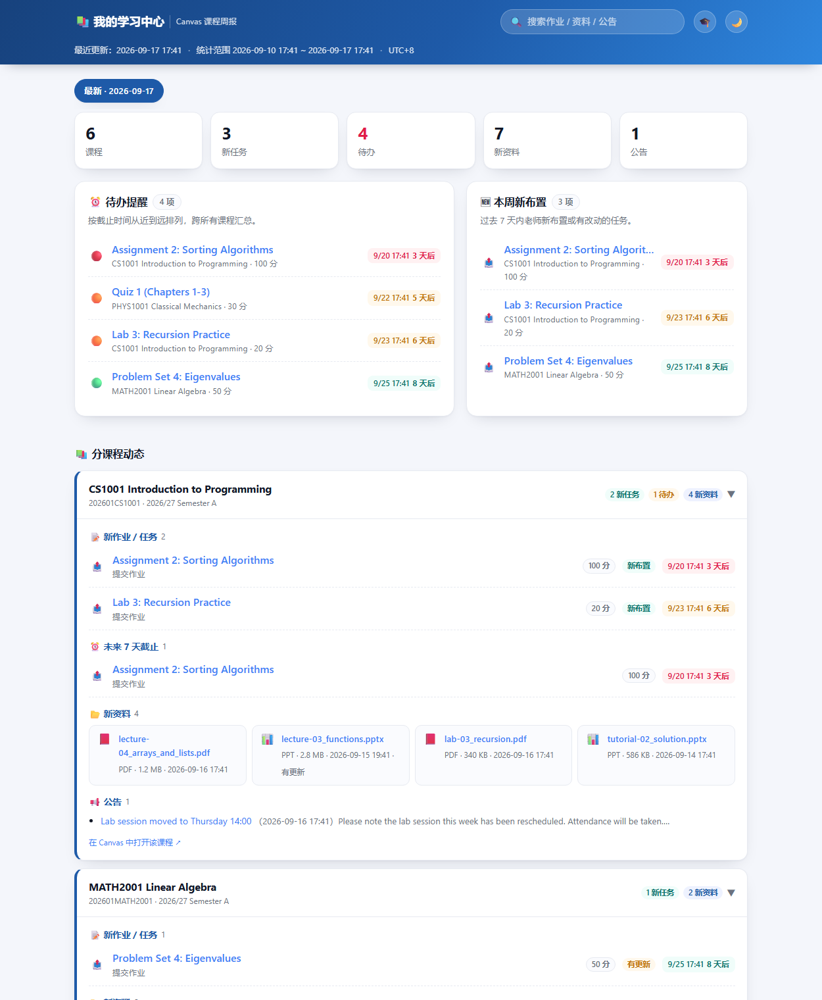
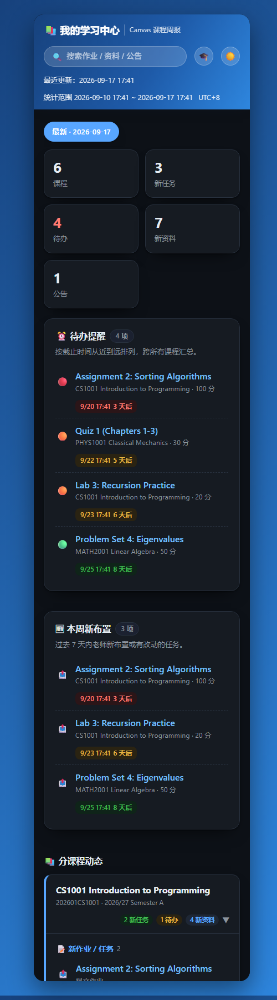

# Canvas Weekly Hub 🎓

**Canvas Weekly Hub** —— 为 [Canvas LMS](https://www.instructure.com/canvas) 打造的全自动课程周报与个人学习看板。

定时抓取你在 Canvas 上的全部课程动态，生成中文周报保存到本地，并自动发布到一个属于你的 GitHub Pages 学习网站。适用于任何使用 Canvas 的学校（默认示例为香港城市大学，改一行配置即可适配你自己的学校）。

> 下方截图为**虚构示例数据**的界面预览（不含任何真实用户的课程信息）。

## ✨ 功能

- ⏰ **待办提醒**：跨课程汇总所有带截止时间的任务，按紧急度排序并显示倒计时（今天／明天／N 天后）
- 🆕 **每周新布置**：过去 7 天老师新布置或有改动的作业，一眼看清要做什么
- 📚 **分课程动态**：新作业、新上传的 PPT/PDF 资料（带类型图标和大小）、新公告
- 🗓 **周报归档**：数据每周自动累积，可切换查看历史任意一周
- 🔍 **跨周搜索**：按名称检索历史全部作业、资料、公告
- 🌗 **深色模式**：跟随系统，亦可手动切换
- 📄 **本地周报**：每次生成 markdown 文件存档，方便复习
- 🤖 **AI 汇报**（可选）：配合 ZCode 自动化任务，每周五晚用中文向你汇报本周要点

## 🖼 界面

| 桌面 · 浅色 | 手机 · 深色 |
|---|---|
|  |  |

## 🔧 工作原理

```
定时任务（ZCode / 任务计划程序）
        │ 每周五 19:00
        ▼
canvas_weekly_report.py
        │ Canvas REST API（你的个人 Token，只存本地）
        ▼
 ┌────────────────────┬─────────────────────────┐
 ▼                    ▼                         ▼
reports/周报.md      网站仓库 data.json        终端摘要输出
（本地存档）          （git push）              （AI 任务整理后汇报）
                      ▼
              GitHub Pages 学习网站
```

## 🚀 快速开始

完整分步教程见 **[docs/部署指南.md](docs/部署指南.md)**，大致流程（约 30 分钟）：

1. 克隆本仓库作为工作目录，安装 Python 3.10+ / Git / GitHub CLI
2. 从学校 Canvas 网页生成个人 API Token
3. 复制 `config/canvas_config.example.json` 为 `canvas_config.json`，**填入你自己的 Token**
4. 用 `gh` 创建你自己的 GitHub Pages 仓库并推送初始文件
5. 跑一次脚本验证，然后在 ZCode 里创建每周定时任务

## 📁 目录结构

```
canvas_weekly_report.py      # 周报脚本：抓取 Canvas → 生成周报 → 更新网站
site-template/index.html     # 学习网站首页模板（单文件，无构建依赖）
config/canvas_config.example.json   # 配置模板（Token 留空，由你自己填写）
config/data.template.json    # 网站初始空数据文件
docs/部署指南.md              # 从零到跑通的完整分步教程
docs/screenshots/            # 界面截图
```

## ⚙️ 配置说明

`canvas_config.json`（由模板复制而来，**不会也不会被提交**）：

| 字段 | 说明 | 默认 |
|---|---|---|
| `canvas_url` | 你学校 Canvas 的地址，如 `https://canvas.cityu.edu.hk` | — |
| `access_token` | 你的 Canvas 个人访问令牌，**自行获取并填入** | 空 |
| `lookback_days` | 统计"过去几天"的新内容 | 7 |
| `upcoming_days` | 统计"未来几天"要截止的作业 | 7 |
| `tz_offset_hours` | 展示用时区偏移（小时） | 8（UTC+8） |
| `term_filter` | 只统计匹配该关键字的学期，留空 = 全部活跃课程 | 空 |
| `github.username` | 你的 GitHub 用户名 | — |
| `github.repo_name` | 你的学习网站仓库名 | learning-hub |
| `github.repo_dir` | 本机网站仓库的绝对路径 | — |
| `github.push_enabled` | 是否自动 commit + push 网站数据 | true |

## 🔐 安全与隐私（重要）

**算法公开，数据私有** —— 本仓库只有通用代码与模板，**不含任何使用者的课程数据**。每个人的课程信息都留在他自己的电脑和自己的仓库里：

| 内容 | 位置 | 可见性 |
|---|---|---|
| 脚本、页面模板、文档 | 本仓库（公开） | 所有人可见，随便分享 |
| `canvas_config.json`（含 Token） | 使用者本机 | 仅自己，`.gitignore` 已排除，不会入库 |
| 课程数据仓库 `learning-hub` | 使用者自己的 GitHub 仓库 | **可设为私有**，课程信息仅自己可见 |

- **完全不想公开网页？** 把网站仓库设为 Private（免费账号的 Pages 会随之停用），改为**本地看板**：在仓库目录运行 `python -m http.server 8137`，浏览器打开 `http://localhost:8137/`；同一 WiFi 下手机也能访问。周报脚本与数据更新不受影响，`git push` 仍可作为云端备份。详见[部署指南第 5 步](docs/部署指南.md)。
- **本仓库不包含任何人的 Canvas 凭证。** `canvas_config.json` 需由使用者自己创建并填入自己的 Token（从 `config/canvas_config.example.json` 复制）。
- Token 只保存在使用者本机，等同于账号凭证——不要提交、不要分享。若怀疑泄露，到 Canvas「账户 → 设置」删除该令牌即立即失效。
- 课程数据仓库里只有页面代码与课程任务摘要（作业名/截止时间/文件名），不含 Token，也不含作业正文。
- 不小心把 Token 提交进了某个仓库？立即吊销旧 Token，必要时删除该仓库重建。

## ❓ 常见问题

见 [docs/部署指南.md 第 9 节](docs/部署指南.md#9-常见问题排查)（401 认证失败、GH007 邮箱隐私拦截、CDN 缓存、本地打开无数据等）。

## 📄 许可证

[MIT](LICENSE)
