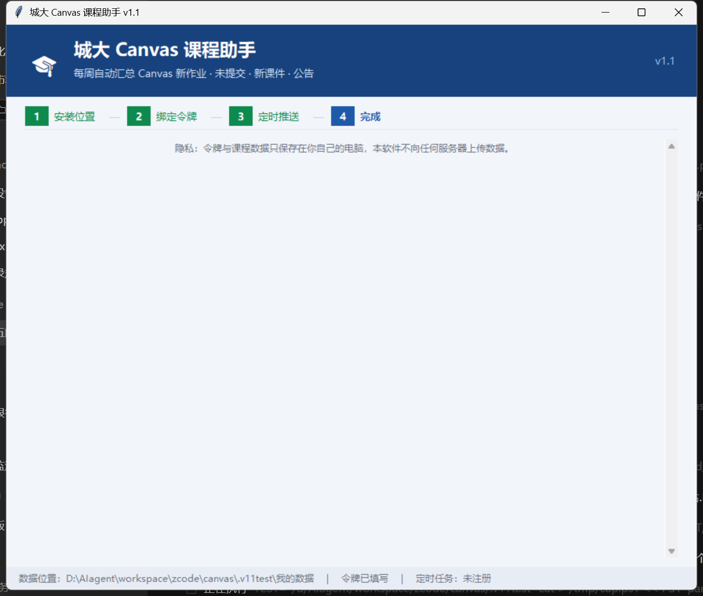
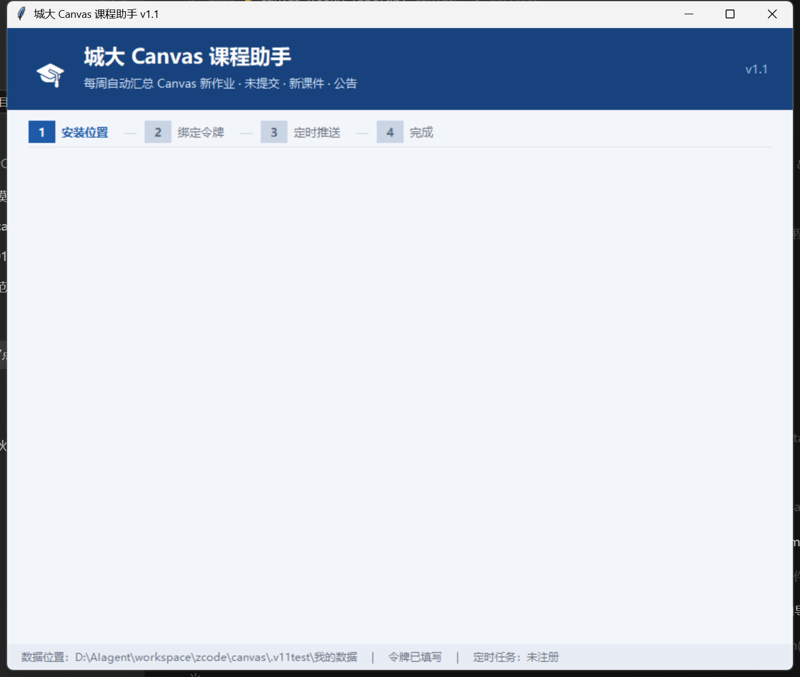
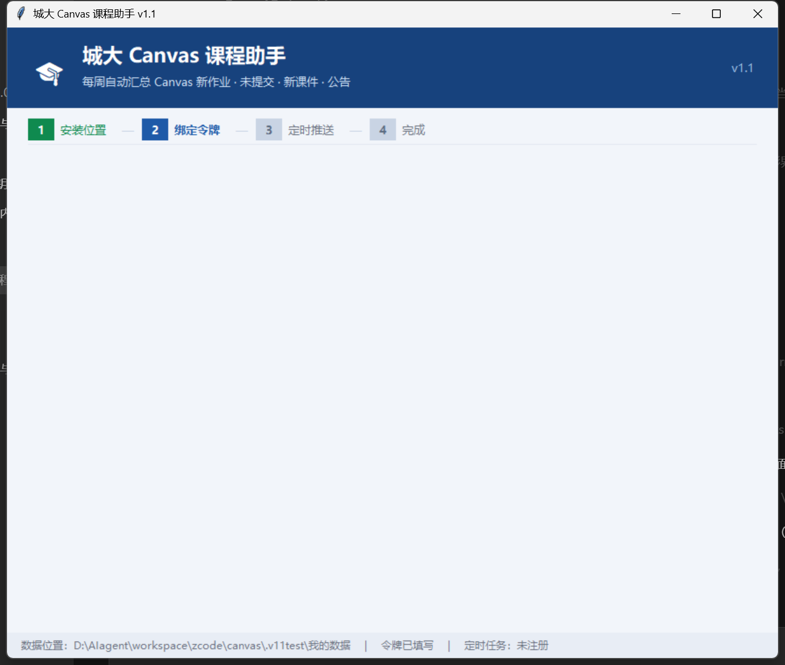

# 城大 Canvas 课程助手 · 安装包使用手册

> 这份手册面向**不使用 AI agent** 的同学：下载一个小软件，像安装普通软件一样走一遍向导，
> 之后每周自动帮你汇总课程动态并打开你的个人学习网站。
> 全程不需要命令行、不需要安装 Python。

---

## 目录

1. [这个软件能做什么](#1-这个软件能做什么)
2. [下载与运行](#2-下载与运行)
3. [首次使用：四步向导](#3-首次使用四步向导)
4. [平时怎么用](#4-平时怎么用)
5. [文件都在哪](#5-文件都在哪)
6. [常见问题](#6-常见问题)
7. [隐私说明](#7-隐私说明)
8. [卸载](#8-卸载)

---

## 1. 这个软件能做什么

每周自动登录你的 Canvas，把本学期所有课程的变化汇总给你：

- ⏰ **待办提醒**：所有带截止时间的任务，按紧急度排序并显示倒计时（今天／明天／N 天后）
- ✅ **提交状态**：哪些交了、哪些**还没交**，一眼可见
- 🔄 **变化检测**：老师改期、新评分、删除作业都会单独告诉你
- 📥 **课件自动下载**：新上传的 PPT/PDF 自动按课程存到你电脑上，复习不用再逐个点
- 📅 **日历导出**：截止时间可导入手机日历，到点系统提醒
- 🌐 **个人学习网站**：每次运行生成「**我的学习网站.html**」，双击即可打开，可拷到手机离线看

---

## 2. 下载与运行

**系统要求**：Windows 10 / 11（64 位）

### 下载

打开发布页下载 `CityU-Canvas-Assistant-v1.1.0.exe`（约 12 MB）：

**👉 https://github.com/Famalhaut04/canvas-weekly-hub/releases/latest**

### 放在哪里

把 exe 放到一个**你有写入权限、且不会随手删掉**的文件夹（例如 `D:\城大Canvas课程助手\`）。

- ❌ 不要放在 `C:\Program Files\`（需要管理员权限，会导致无法保存数据）
- 数据（周报、课件、网站）保存在向导里选择的位置，与 exe 位置无关

### 首次运行会看到安全提示（正常现象）

因为这是个人开发、未购买数字签名的程序，Windows 可能弹出蓝色窗口「**Windows 已保护你的电脑**」：

1. 点 **更多信息**
2. 点 **仍要运行**

如果同时弹出防火墙询问（用于下载课件），选 **允许访问** 即可。

> 首次双击启动会稍慢（3～5 秒），因为程序需要解压自身组件；之后就正常了。

---

## 3. 首次使用：四步向导

双击打开软件后，会像安装普通软件一样走一遍向导（之后再次打开直接进主界面）：

### ① 选择数据保存位置

- 点「**浏览…**」选一个文件夹（默认在软件旁边新建 `CanvasData`）
- 下方会显示该磁盘的可用空间
- 点「下一步」时会自动检测文件夹是否可写

### ② 绑定 Canvas 令牌

1. 浏览器登录 https://canvas.cityu.edu.hk
2. 左下角 **账户(Account) → 设置(Settings)** → 页面底部 **已批准的集成** → **+ 新访问令牌**
3. 生成后**立刻复制**（只显示一次），粘贴到软件里
4. 顺手把令牌生成页显示的到期日期填进「到期日期」——城大令牌最长 90 天，填了之后软件会在**剩 5 天**时提醒你更换
5. 点「**🔌 测试连接**」，显示「✅ 连接成功，检测到 N 门活跃课程」即可

> ⚠️ 令牌等同于你的账号凭证，**不要发给任何人、不要截图分享**。它只保存在你自己电脑的数据文件夹里。

### ③ 设置每周自动推送

- 选频率（每周/每天）、星期、时间（默认周五 19:00）
- 点「**完成，进入软件**」即注册 Windows 计划任务
- 需要电脑处于**开机且已登录**状态；关机时当次不补跑，下次到点照常

### ④ 完成：主界面

进入主界面后建议先点一次「**🚀 立即抓取并生成网站**」：

- 软件会抓取你的全部课程，下载新课件
- 在数据文件夹生成 **「我的学习网站.html」** 并自动用浏览器打开
- 主界面自带使用说明、运行日志和所有常用入口

---

## 4. 平时怎么用

| 场景 | 操作 |
|---|---|
| 每周自动推送 | 什么都不用做，到点自动弹出「我的学习网站」 |
| 想临时看一眼 | 数据文件夹双击「**我的学习网站.html**」，或打开软件点「🌐 打开我的学习网站」 |
| 手动刷新数据 | 软件主界面 → 「🚀 立即抓取并生成网站」 |
| 看历史周报 | 网站顶部「最新 / 日期」按钮切换往期 |
| 找某份课件 | 软件点「📂 课件文件夹」，按课程代码分好了文件夹 |
| 导入手机日历 | 双击 `deadlines.ics`，或用网站顶部的「📅 截止日历」 |
| 改令牌 / 改时间 | 主界面底部「⚙️ 设置」里的按钮 |

---

## 5. 文件都在哪

打开**向导里选择的保存位置**，你会看到：

| 文件/文件夹 | 内容 |
|---|---|
| `我的学习网站.html` | **你的个人学习网站**，双击打开（每次运行自动更新） |
| `reports\` | 每周的周报（`.md`）和按日期归档的看板网页 |
| `downloads\` | 自动下载的课件，按课程代码分文件夹 |
| `deadlines.ics` | 截止日历，双击导入手机日历 |
| `canvas_config.json` | 你的配置（**含令牌，不要分享这个文件**） |
| `last_state.json` | 变化检测快照，**不要删除**，删了就无法检测改期 |
| `run.log` | 每次自动运行的记录（排查"到底跑了没有"看这个） |

> exe 旁边还有一个 `hub_home.json`，记住你的数据保存在哪，同样不要删除。

---

## 6. 常见问题

| 现象 | 原因与解决 |
|---|---|
| 弹出「Windows 已保护你的电脑」 | 未签名程序的正常提示：点「更多信息」→「仍要运行」 |
| 双击没反应 / 闪一下就没了 | 等 5 秒（首次解压较慢）；若仍无反应，右键 → 以管理员身份运行试试 |
| 提示「连接失败 HTTP 401」 | 令牌错误或已过期：到 Canvas 重新生成，回主界面「⚙️ 设置 → 改令牌」更新 |
| 提示「无法连接 Canvas」 | 网络问题：确认浏览器能打开 canvas.cityu.edu.hk 后重试 |
| 测试连接显示 0 门课程 | Canvas 地址填错（应为 `https://canvas.cityu.edu.hk`） |
| 到点没有自动弹出网站 | 检查：① 电脑是否开机并已登录；② 底部状态栏是否显示「已注册」；③ 看 `run.log` 有没有运行记录 |
| 注册定时任务失败 | 右键 exe →「以管理员身份运行」后再走一遍向导 |
| 收不到 Token 到期提醒 | 需在向导第②步填写「到期日期」，软件会在剩 5 天时提醒 |
| 想换电脑 | 把整个数据文件夹 + exe 拷过去，重新走一遍向导（第②步令牌不用重填，数据都在） |

---

## 7. 隐私说明

- **令牌只存在你自己电脑上**：保存在数据文件夹的 `canvas_config.json`，不会上传到任何服务器或仓库。
- **课程数据不上传**：所有数据都在本地文件夹里。本软件不会把你的课程、作业、成绩发给任何人。
- **本软件只读取、不修改**：它仅调用 Canvas 的查询接口读取课程信息，不会替你提交作业、不会改动任何内容。
- **操作记录**：Canvas 会记录令牌的创建与使用，如需彻底停止，删除令牌即可立即失效。

---

## 8. 卸载

1. 打开软件，主界面「⚙️ 设置」里点「改定时时间」→「取消定时任务」（或控制面板删计划任务 `CityU-Canvas-Assistant`）
2. 删除数据文件夹和 exe
3. 如需彻底注销访问权限：到 Canvas「账户 → 设置」删除该访问令牌

---

*本手册对应版本 v1.1.0 · 项目地址：https://github.com/Famalhaut04/canvas-weekly-hub*
