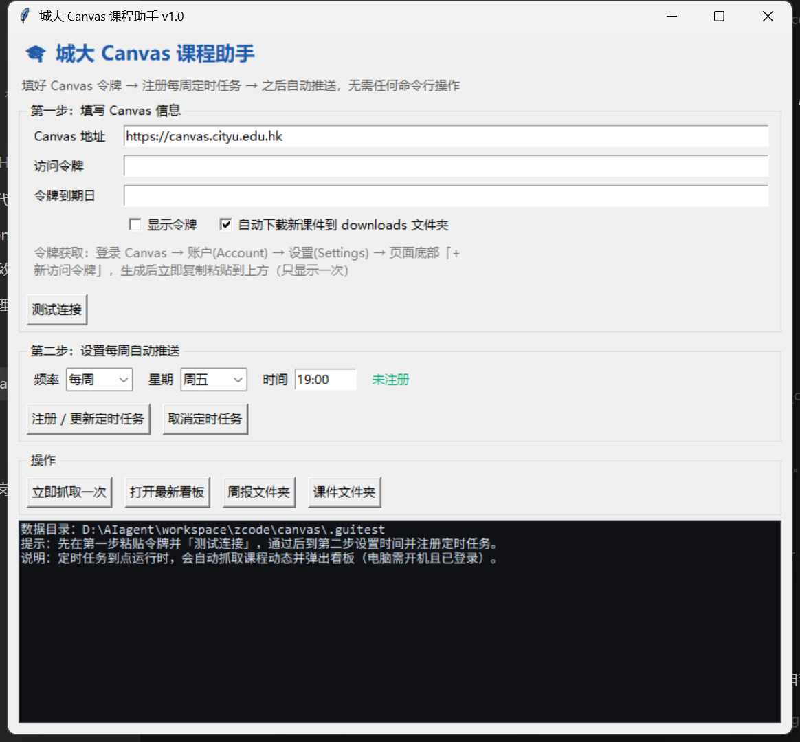

# 城大 Canvas 课程助手 · 安装包使用手册

> 这份手册面向**不使用 AI agent** 的同学：下载一个小软件，填一次令牌，之后每周自动帮你汇总课程动态。
> 全程不需要命令行、不需要安装 Python。

---

## 目录

1. [这个软件能做什么](#1-这个软件能做什么)
2. [下载与运行](#2-下载与运行)
3. [三步配置](#3-三步配置)
4. [平时怎么用](#4-平时怎么用)
5. [文件都在哪](#5-文件都在哪)
6. [常见问题](#6-常见问题)
7. [隐私说明](#7-隐私说明)
8. [卸载](#8-卸载)

---

## 1. 这个软件能做什么

每周自动登录你的 Canvas，把本学期所有课程的变化汇总给你：

- ⏰ **待办提醒**：所有带截止时间的任务，按紧急度排序并显示倒计时（今天／明天／N 天后）
- ✅ **提交状态**：哪些交了、哪些**还没交**，一眼可见
- 🔄 **变化检测**：老师改期、新评分、删除作业都会单独告诉你
- 📥 **课件自动下载**：新上传的 PPT/PDF 自动按课程存到你电脑上，复习不用再逐个点
- 📅 **日历导出**：截止时间可导入手机日历，到点系统提醒
- 🗓 **看板**：每周生成一个网页文件，双击就能看历史归档、搜索往期作业

---

## 2. 下载与运行

**系统要求**：Windows 10 / 11（64 位）

### 下载

打开发布页下载 `CityU-Canvas-Assistant-v1.0.0.exe`（约 12 MB）：

**👉 https://github.com/Famalhaut04/canvas-weekly-hub/releases/latest**

### 放在哪里（重要）

把 exe 放到一个**你有写入权限、且不会随手删掉**的文件夹，推荐：

- ✅ `D:\城大Canvas课程助手\`（推荐，自己新建一个文件夹）
- ✅ 桌面、文档文件夹
- ❌ 不要放在 `C:\Program Files\`（需要管理员权限，会导致无法保存数据）

> 软件会在**自己所在的文件夹**里创建配置文件、周报、下载的课件。所以文件夹建在哪儿，数据就在哪儿——建议单独建一个文件夹，方便以后整体备份或删除。

### 首次运行会看到安全提示（正常现象）

因为这是个人开发、未购买数字签名的程序，Windows 可能弹出蓝色窗口「**Windows 已保护你的电脑**」：

1. 点 **更多信息**
2. 点 **仍要运行**

如果同时弹出防火墙询问（用于下载课件），选 **允许访问** 即可。

> 首次双击启动会稍慢（3～5 秒），因为程序需要解压自身组件；之后就正常了。

---

## 3. 三步配置

### 第一步：填写 Canvas 信息

**① 获取访问令牌**（只在第一次需要做）：

1. 浏览器登录 https://canvas.cityu.edu.hk
2. 左下角点 **账户(Account) → 设置(Settings)**
3. 页面拉到最底部，找到 **已批准的集成（Approved Integrations）**，点 **+ 新访问令牌**
4. 弹窗里「目的」随便填（例如 `weekly-report`），截止日期保持默认
5. 点 **生成令牌**，**立刻复制**那串字符（只显示这一次！）

**② 粘贴到软件里**：

- **访问令牌**：粘贴刚才复制的字符
- **令牌到期日**：填令牌生成页显示的日期（如 `2026-12-16`）。**这一项建议填**——城大令牌最长只有 90 天有效期，填了之后软件会在到期前 5 天提醒你更换，避免突然失效
- 勾选「**自动下载新课件到 downloads 文件夹**」（默认已勾选）

**③ 点「测试连接」**：显示「连接成功，检测到 N 门活跃课程」就说明配置对了。

> ⚠️ 令牌等同于你的账号凭证，**不要发给任何人、不要截图分享、不要上传到任何网站**。它只保存在你自己电脑的这个软件文件夹里。若怀疑泄露，回到 Canvas 设置页删除该令牌即可立即失效。

### 第二步：设置每周自动推送

- **频率**：每周（推荐）
- **星期**：周五
- **时间**：`19:00`（或你方便的时间）

点 **「注册 / 更新定时任务」**。看到「已注册定时任务：每周FRI 19:00」即成功，右侧状态会显示下次运行时间。

> 到点后软件会自动抓取并**弹出本周看板**（用你的默认浏览器打开）。
> 需要电脑处于**开机且已登录**状态；关机或休眠时当次不会补跑，下次到点会正常执行。
> 想改时间：直接改上方的时间再点一次「注册 / 更新定时任务」。
> 想取消：点「取消定时任务」。

### 第三步：先手动试一次

点 **「立即抓取一次」**，下方日志区会显示结果，并自动打开看板。确认效果满意就不需要再做什么了。

---

## 4. 平时怎么用

| 场景 | 操作 |
|---|---|
| 每周自动推送 | 什么都不用做，到点自动弹出看板 |
| 想临时看一眼 | 双击 exe → 点「打开最新看板」 |
| 手动刷新数据 | 双击 exe → 点「立即抓取一次」 |
| 看历史周报 | 看板顶部有「最新 / 日期」按钮，可切换往期 |
| 找某份课件 | 点「课件文件夹」，按课程代码分好了文件夹 |
| 导入手机日历 | 双击文件夹里的 `deadlines.ics`，或用看板顶部的「📅 截止日历」 |

---

## 5. 文件都在哪

打开软件所在文件夹，你会看到：

| 文件/文件夹 | 内容 |
|---|---|
| `canvas_config.json` | 你的配置（**含令牌，不要分享这个文件**） |
| `reports\` | 每周的周报（`.md`）和看板网页（`本周课程动态_日期.html`） |
| `downloads\` | 自动下载的课件，按课程代码分文件夹 |
| `deadlines.ics` | 截止日历，可导入手机日历 |
| `data.json` | 看板数据（历史归档来源） |
| `last_state.json` | 变化检测用的上次快照，**不要删除**，删了就无法检测改期 |
| `run.log` | 每次自动运行的记录（排查"到底跑了没有"看这个） |

---

## 6. 常见问题

| 现象 | 原因与解决 |
|---|---|
| 弹出「Windows 已保护你的电脑」 | 未签名程序的正常提示：点「更多信息」→「仍要运行」 |
| 双击没反应 / 闪一下就没了 | 等 5 秒（首次解压较慢）；若仍无反应，右键 → 以管理员身份运行试试 |
| 提示「连接失败 HTTP 401」 | 令牌错误或已过期：重新生成令牌并替换 |
| 提示「无法连接 Canvas」 | 网络问题：确认浏览器能打开 canvas.cityu.edu.hk 后重试 |
| 显示 0 门课程 | Canvas 地址填错（应为 `https://canvas.cityu.edu.hk`） |
| 到点没有自动弹出看板 | 检查：① 电脑是否开机并已登录；② 软件里状态是否显示「已注册」；③ 看 `run.log` 有没有运行记录 |
| 注册定时任务失败 | 右键 exe →「以管理员身份运行」后再点一次 |
| 收不到 Token 到期提醒 | 需在第一步填写「令牌到期日」，软件会在剩 5 天时提醒 |
| 想确认有没有在跑 | 打开 `run.log`，每次运行都会追加一行记录 |
| 课件重复下载占空间 | 同名同大小文件会自动跳过；日志里显示「跳过 N」即未重复下载 |
| 想换电脑 | 把整个软件文件夹拷过去，重新注册一次定时任务即可 |

---

## 7. 隐私说明

- **令牌只存在你自己电脑上**：保存在软件文件夹的 `canvas_config.json`，不会上传到任何服务器或仓库。
- **课程数据不上传**：所有数据都在本地文件夹里。本软件不会把你的课程、作业、成绩发给任何人。
- **本软件只读取、不修改**：它仅调用 Canvas 的查询接口读取课程信息，不会替你提交作业、不会改动任何内容。
- **操作记录**：Canvas 会记录令牌的创建与使用，如需彻底停止，删除令牌即可立即失效。

---

## 8. 卸载

1. 打开软件，点「**取消定时任务**」
2. 删除整个软件文件夹（你的配置、周报、下载的课件都在里面）
3. 如需彻底注销访问权限：到 Canvas「账户 → 设置」删除该访问令牌

---

*本手册对应版本 v1.0.0 · 项目地址：https://github.com/Famalhaut04/canvas-weekly-hub*
